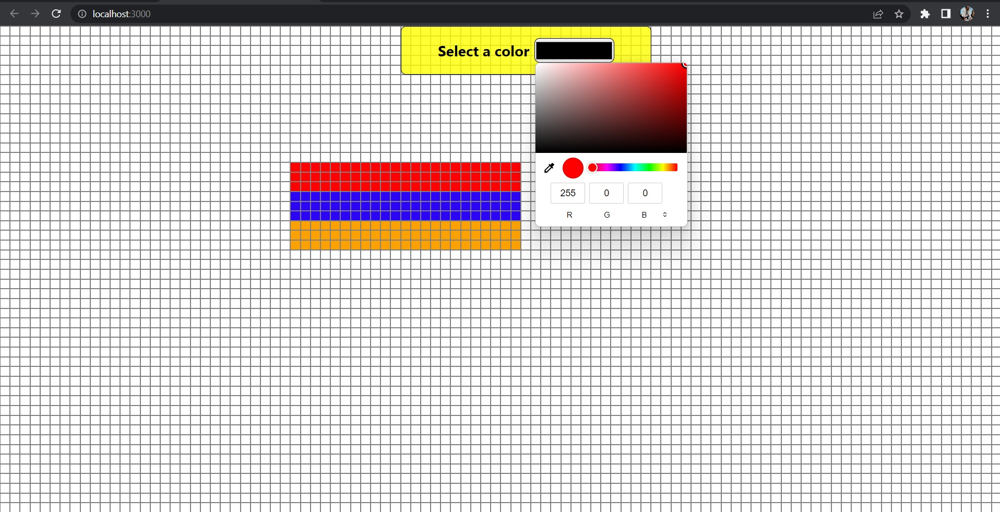

# A small app where the screen is full of cells, you can paint them by clicking or dragging the mouse, also you can choose the color!

Link to Website [https://paint-it-yourself.web.app/](https://paint-it-yourself.web.app/)

## The task was to develop a small fullscreen grid, which can be used to paint simple images. The grid consists of small square cells. There should be 100 cells horizontally. The number of rows should not exceed the bounds of the window. In other words, the screen should be filled with cells, but there are no scrollbars, since all cells fit within the window. Whenever a cell is clicked, the cell should be "activated" by changing color. When the cell is clicked again, the cell is deactivated and the color is removed. Whenever a cell is clicked with the right mouse button, a popup should appear where you can choose a color. A minimum of 5 colors is required. The chosen color becomes the default color for each cell while drawing. • The color picker appears (fadeIn) when you press the right mouse button at the position of the mouse

• The browser specific context menu is not shown when pressing the right mouse button
• The color picker disappears (fadeOut) when the mouse moves outside the color picker or when a color is pressed

## To make it easier to draw images, it should be possible to draw images by dragging your mouse. Whenever a cell is clicked, the dragging starts. All cells that the mouse moves over should be activated. When the mouse is released, dragging stops and the cells are no longer activated by mouse movement. It should still be possible to click each cell individually next to dragging

# Getting Started with Create React App

This project was bootstrapped with [Create React App](https://github.com/facebook/create-react-app).

## Available Scripts

In the project directory, you can run:

### `npm start`

Runs the app in the development mode.\
Open [http://localhost:3000](http://localhost:3000) to view it in your browser.

The page will reload when you make changes.\
You may also see any lint errors in the console.

### `npm test`

Launches the test runner in the interactive watch mode.\
See the section about [running tests](https://facebook.github.io/create-react-app/docs/running-tests) for more information.

### `npm run build`

Builds the app for production to the `build` folder.\
It correctly bundles React in production mode and optimizes the build for the best performance.

The build is minified and the filenames include the hashes.\
Your app is ready to be deployed!

See the section about [deployment](https://facebook.github.io/create-react-app/docs/deployment) for more information.

### `npm run eject`

**Note: this is a one-way operation. Once you `eject`, you can't go back!**

If you aren't satisfied with the build tool and configuration choices, you can `eject` at any time. This command will remove the single build dependency from your project.

Instead, it will copy all the configuration files and the transitive dependencies (webpack, Babel, ESLint, etc) right into your project so you have full control over them. All of the commands except `eject` will still work, but they will point to the copied scripts so you can tweak them. At this point you're on your own.

You don't have to ever use `eject`. The curated feature set is suitable for small and middle deployments, and you shouldn't feel obligated to use this feature. However we understand that this tool wouldn't be useful if you couldn't customize it when you are ready for it.

## Learn More

You can learn more in the [Create React App documentation](https://facebook.github.io/create-react-app/docs/getting-started).

To learn React, check out the [React documentation](https://reactjs.org/).

### Code Splitting

This section has moved here: [https://facebook.github.io/create-react-app/docs/code-splitting](https://facebook.github.io/create-react-app/docs/code-splitting)

### Analyzing the Bundle Size

This section has moved here: [https://facebook.github.io/create-react-app/docs/analyzing-the-bundle-size](https://facebook.github.io/create-react-app/docs/analyzing-the-bundle-size)

### Making a Progressive Web App

This section has moved here: [https://facebook.github.io/create-react-app/docs/making-a-progressive-web-app](https://facebook.github.io/create-react-app/docs/making-a-progressive-web-app)

### Advanced Configuration

This section has moved here: [https://facebook.github.io/create-react-app/docs/advanced-configuration](https://facebook.github.io/create-react-app/docs/advanced-configuration)

### Deployment

This section has moved here: [https://facebook.github.io/create-react-app/docs/deployment](https://facebook.github.io/create-react-app/docs/deployment)

### `npm run build` fails to minify

This section has moved here: [https://facebook.github.io/create-react-app/docs/troubleshooting#npm-run-build-fails-to-minify](https://facebook.github.io/create-react-app/docs/troubleshooting#npm-run-build-fails-to-minify)
